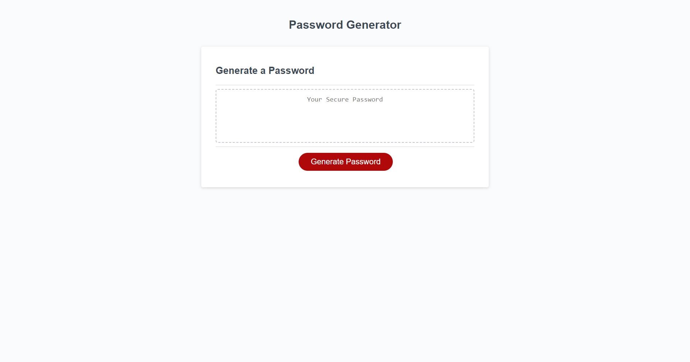

# Protect Your Things

## Description

What I have created is a password generator that will specifically allow the user to create a password between the lengths of 8-128 characters that has the ability to include or exclude alphabet, numbers and special characters. The reason for creating this simple app is to practice and apply javascript concepts that take user information and returns a result that matches the criteria they set. With this simple generator, you are able to produce random passwords to use for most use cases so that you can have more security on your private information. Completing this project allowed me to practice coding in javascript including basic concepts such as variables, functions, and if statements.

## Table of Contents

- [Usage](#usage)
- [Credits](#credits)
- [License](#license)

## Usage

Navigate to the urls located below and follow the directions to generate passwords. They must be between 8-128 characters long otherwise the prompt will ask you to restart. You may choose from lower case and uppercase letters. You can also include numbers and special characters. 

[Github Page](https://github.com/Dannymak1993/Protect-Your-Things)

[Repository](https://dannymak1993.github.io/Protect-Your-Things/)

## Credits

I googled many concepts referring to functions and variables. I also referred to many class activites for ideas on how to use if and else statements. 

## License

The MIT License (MIT)

Copyright (c) 2015 Chris Kibble

Permission is hereby granted, free of charge, to any person obtaining a copy of this software and associated documentation files (the "Software"), to deal in the Software without restriction, including without limitation the rights to use, copy, modify, merge, publish, distribute, sublicense, and/or sell copies of the Software, and to permit persons to whom the Software is furnished to do so, subject to the following conditions:

The above copyright notice and this permission notice shall be included in all copies or substantial portions of the Software.

THE SOFTWARE IS PROVIDED "AS IS", WITHOUT WARRANTY OF ANY KIND, EXPRESS OR IMPLIED, INCLUDING BUT NOT LIMITED TO THE WARRANTIES OF MERCHANTABILITY, FITNESS FOR A PARTICULAR PURPOSE AND NONINFRINGEMENT. IN NO EVENT SHALL THE AUTHORS OR COPYRIGHT HOLDERS BE LIABLE FOR ANY CLAIM, DAMAGES OR OTHER LIABILITY, WHETHER IN AN ACTION OF CONTRACT, TORT OR OTHERWISE, ARISING FROM, OUT OF OR IN CONNECTION WITH THE SOFTWARE OR THE USE OR OTHER DEALINGS IN THE SOFTWARE.